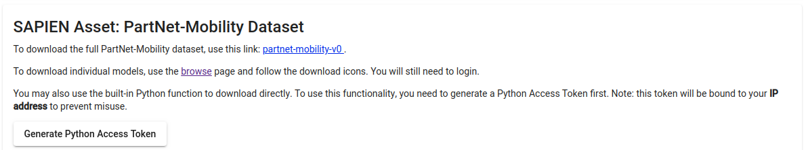
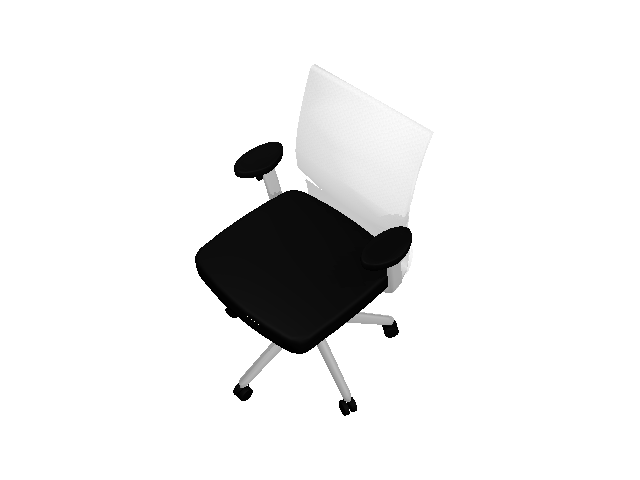

.. _render:

SAPIEN assets and rendering
=======================================

.. highlight:: python
   :linenothreshold: 5

In this tutorial, you will learn the following:

* Download SAPIEN asset in Python and load it into sapien.
* Setup customized camera in simulation scene.
* Off-screen rendering for RGB, depth, segmentation and point cloud.

This tutorial will focus on how to download SAPIEN assets in Python and perform off-screen rendering.

Get your unique access token
--------------------------------------------------------------------------------

In order to download the SAPIEN assets, your need to fist register on `SAPIEN website <https://sapien.ucsd.edu/>`_,
When logging in, you can see the ``Generate Python Access Token`` on the `Download page <https://sapien.ucsd.edu/downloads>`_.

Generate your unique access token which will be used later in your Python script to download the data.

Download SAPIEN assets in Python
--------------------------------------------------------------------------------

Download SAPIEN assets is really simple in Python, you can directly get the URDF file from SAPIEN server.

.. literalinclude:: ../../../../example/basic/render_sapien_assets.py
   :lineno-start: 8
   :lines: 8-10

.. warning::
   The generated token can only be used for the unique IP address. If you are working with dynamic IP, it is recommended to download the whole dataset before use.

OpenGL vs Vulkan
--------------------------------------------------------------------------------

SAPIEN now supports Vulkan for rendering, and we plan to move away from OpenGL.
Vulkan has the advantage of "truly" off-screen. Unlike OpenGL, it does not
require x-server to render, so it is easier to set up on servers. And unlike
OpenGL, Vulkan will not mess with other packages that requires on-screen display
such as matplotlib, making SAPIEN more compatible with other packages. However,
it does have some limitations, one being not able to use CPU to render (but if
you are really using CPU OpenGL, you should probably stop and get a GPU).

.. note:: The following sections will be written for the Vulkan-based renderer.
   If you are looking for OpenGL, jump to sections marked "OpenGL, deprecated".

Vulkan environment setup
--------------------------------------------------------------------------------

Before any rendering, you need to check several things.

1. Make sure you are using Linux.
   
2. Make sure your Vulkan icd file is present by looking at ``ls /usr/share/vulkan/icd.d``. For example, if you are using Nvidia, you should see ``nvidia_icd.json`` in this directory. If not, you need to install a
   Vulkan-compatible GPU driver. If you are using AMD or Intel GPU, you will see similar icd files.

3. Set the environment variable to tell Vulkan to use a proper GPU. For example, to tell Vulkan to use your Nvidia GPU, run ``export VK_ICD_FILENAMES=/usr/share/vulkan/icd.d/nvidia_icd.json`` in your shell environment. You may consider adding this line to your ``.bashrc`` or ``.zshrc`` file.

Create Camera in Simulation Scene
--------------------------------------------------------------------------------

Before creating a camera, make some preparation like before.

.. literalinclude:: ../../../../example/basic/render_sapien_assets_vulkan.py
   :lineno-start: 12
   :lines: 12-22

We use ``sapien.VulkanRenderer(offscree_only)`` to create the Vulkan-based
renderer. Passing in ``True`` for the argument will disable on-screen display,
and it will work without a window server such as an x-server. You can forget
about all the difficulties working with x-server and OpenGL!

Next, you need to create a camera and place it at the right place as follows:

.. literalinclude:: ../../../../example/basic/render_sapien_assets.py
   :lineno-start: 24
   :lines: 24-36

Camera should be placed on an ``Actor``, which is an object in the ``scene``.
If the actor is moving during simulation, the camera will move accordingly.
Thus by setting the position and orientation of the mounted actor, we could set the pose of camera.

.. note::
   Note that the coordinate convention for SAPIEN is different from other graphics software, in order to match the robotics convention. The forward direction is x, y for left and z for up.

Rendering RGB Image
--------------------------------------------------------------------------------

To render a RGB image using the offscreen renderer, we may first to step simulation to make everything set.
To run the code below, you may need to install `pillow <https://pillow.readthedocs.io/en/stable/>`_
by ``pip install pillow``.

.. literalinclude:: ../../../../example/basic/render_sapien_assets_vulkan.py
   :lineno-start: 53
   :lines: 53-60

This will save a ``color.png`` in your workspace as follows:

Generate viewed Point Cloud
--------------------------------------------------------------------------------

Point cloud is a convenient representation of the 3D scene. The following code
shows how to get the camera-space point cloud in SPAIEN.

Note in the camera space, we use the graphics convention of y up and -z forward.
Line 66 and 67 show how we convert it to z up and x forward.

.. literalinclude:: ../../../../example/basic/render_sapien_assets_vulkan.py
   :lineno-start: 62
   :lines: 62-68

Visualize object segmentation
--------------------------------------------------------------------------------

SAPIEN assets is build upon the `PartNet Dataset <https://cs.stanford.edu/~kaichun/partnet/>`_, which provides
part level segmentation for objects. To run the code below, install `Open3D <http://www.open3d.org/docs/release/index.html>`_
first by ``pip install open3d``.

.. literalinclude:: ../../../../example/basic/render_sapien_assets_vulkan.py
   :lineno-start: 70
   :lines: 70-79

You will see the visualization from birdview. Use mouse to change the view and press
``Q`` on the keyboard to quit the visualization.

.. figure:: assets/point_cloud.png
   :width: 1080px
   :align: center

.. figure:: assets/rotated_point_cloud.png
   :width: 1080px
   :align: center

Besides ``get_color_rgba``, ``get_obj_segmentation``, ``get_position_rgba`` and ``get_depth``, SAPIEN camera also provides ``get_normal_rgba()``
and ``get_segmentaion()`` and ``get_albedo_rgba()``. The object segmentation is mesh level segmentation where segmentation is
actor level. ``get_obj_segmentation`` is often more fine-grained than ``get_segmentation``.

The entire code
--------------------------------------------------------------------------------

.. literalinclude:: ../../../../example/basic/render_sapien_assets_vulkan.py

.. warning:: The following sections talks about the deprecated OpenGL renderer.
   You do not need to read if you do not intend to use OpenGL.

Create Camera in Simulation Scene (OpenGL, deprecated)
--------------------------------------------------------------------------------

Before create a camera, make some preparation like before.

.. literalinclude:: ../../../../example/basic/render_sapien_assets.py
   :lineno-start: 12
   :lines: 12-22

For offscreen rendering without real-time visualization, you do not need to create a ``RendererController``.
However, you need to create some cameras and place them at the right place as follow:

.. literalinclude:: ../../../../example/basic/render_sapien_assets.py
   :lineno-start: 25
   :lines: 25-37

Camera should be placed on an ``Actor``, which is a object contained in the ``scene``.
If the actor is moving during simulation, the camera will move accordingly.
Thus by setting the position and orientation of the mounted actor, we could set the pose of camera.

.. note::
   Note that the coordinate convention for SAPIEN is different from other graphics software, in order to match the robotics convention. The forward direction is x, y for left and z for up.

Rendering RGB Image (OpenGL, deprecated)
--------------------------------------------------------------------------------

To render a RGB image using the offscreen renderer, we may first to step simulation to make everything set.
To run the code below, you may need to install `pillow <https://pillow.readthedocs.io/en/stable/>`_
by ``pip install pillow``.

.. literalinclude:: ../../../../example/basic/render_sapien_assets.py
   :lineno-start: 44
   :lines: 44-51

This will save a ``color.png`` in your workspace as follow:

Generate viewed Point Cloud (OpenGL, deprecated)
--------------------------------------------------------------------------------

Point cloud is a convenient representation of the 3D scene. The following code shows how to get the point
cloud in SPAIEN. The ``get_depth()`` function will not return the real depth value but a OpenGL depth buffer
instead. The relation between OpenGL depth buffer is given below:

.. math::

   F_{depth} = \frac{1/depth - 1/near}{1/far - 1/near}

, where :math:`F_{depth}` is the OpenGL buffer and depth is real value of depth.

.. literalinclude:: ../../../../example/basic/render_sapien_assets.py
   :lineno-start: 53
   :lines: 53-63

Visualize object segmentation (OpenGL, deprecated)
--------------------------------------------------------------------------------

SAPIEN assets is build upon the `PartNet Dataset <https://cs.stanford.edu/~kaichun/partnet/>`_, which provides
part level segmentation for objects. To run the code below, install `Open3D <http://www.open3d.org/docs/release/index.html>`_
first by ``pip install open3d``.

.. literalinclude:: ../../../../example/basic/render_sapien_assets.py
   :lineno-start: 65
   :lines: 65-72

You will see the visualization from birdview. Use mouse to change the view and press
``Q`` on the keyboard to quit the visualization.

.. figure:: assets/point_cloud.png
   :width: 1080px
   :align: center

.. figure:: assets/rotated_point_cloud.png
   :width: 1080px
   :align: center

Besides ``get_color_rgba()``, ``get_obj_segmentation()`` and ``get_depth``, SAPIEN camera also provides ``get_normal_rgba()``
and ``get_segmentaion()`` and ``get_albedo_rgba()``. The object segmentation is mesh level segmentation where segmentation is
actor level. ``get_obj_segmentation`` is often more fine-grained than ``get_segmentation``.

The entire code (OpenGL, deprecated)
--------------------------------------------------------------------------------

.. literalinclude:: ../../../../example/basic/render_sapien_assets.py
