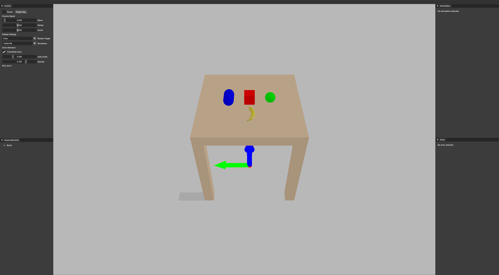

.. _create_actors:

Create Actors
==================

.. highlight:: python

SAPIEN simulates rigid body dynamics. In SAPIEN, **actor** is an alias of rigid body.

In this tutorial, you will learn the following:

* Create ``Actor`` using primitives (box, sphere, capsule)
* Create ``Actor`` using mesh files
* Use ``Pose`` to set the pose

The full script can be downloaded here :download:`create_actors.py <../../../../examples/basic/create_actors.py>`

Create an actor by a single primitive
-------------------------------------------

The primitives supported by SAPIEN include box, sphere and capsule.
Here we show an example about how to create a box.
Examples to create a sphere and a capsule can found in the code provided.

.. literalinclude:: ../../../../examples/basic/create_actors.py
   :dedent: 0
   :lines: 18-45

``Actor`` (or rigid body) is created through ``ActorBuilder`` in SAPIEN.
An actor consists of both collision shapes (used for physical simulation) and visual shapes (used for rendering).
You can call ``add_box_shape`` and ``add_box_visual`` to add collision and visual shapes of an box respectively.

.. note::
   Collision shapes do not necessarily correspond to visual shapes. For example, you might have a simple collision shape for fast simulation, but a complicated visual shape for realistic rendering.

Then, you might create a box as follows:

.. literalinclude:: ../../../../examples/basic/create_actors.py
   :dedent: 0
   :lines: 126-132

The pose of the box in the world frame can be specified by ``Pose``.
``Pose`` describes the 6D pose, consisting of a 3-dim position vector ``p`` and a 4-dim quaternion ``q`` (to represent the rotation).

Create an actor by multiple primitives
-------------------------------------------

Next, we show an example to create an actor (table) by multiple boxes (a tabletop with four legs).

.. literalinclude:: ../../../../examples/basic/create_actors.py
   :dedent: 0
   :lines: 81-111

We can call ``add_box_shape(pose=Pose(...), ...)`` to set the pose of a collision shape in **the actor frame**.
For a visual shape, we call ``add_box_visual(pose=Pose(...), ...)``.
Note that ``table.set_pose(pose)`` sets the pose of the actor in **the world frame**.

Create an actor by a mesh file
-------------------------------------------

Apart from primitives, actors can also be created from mesh files.

.. literalinclude:: ../../../../examples/basic/create_actors.py
   :dedent: 0
   :lines: 156-160

