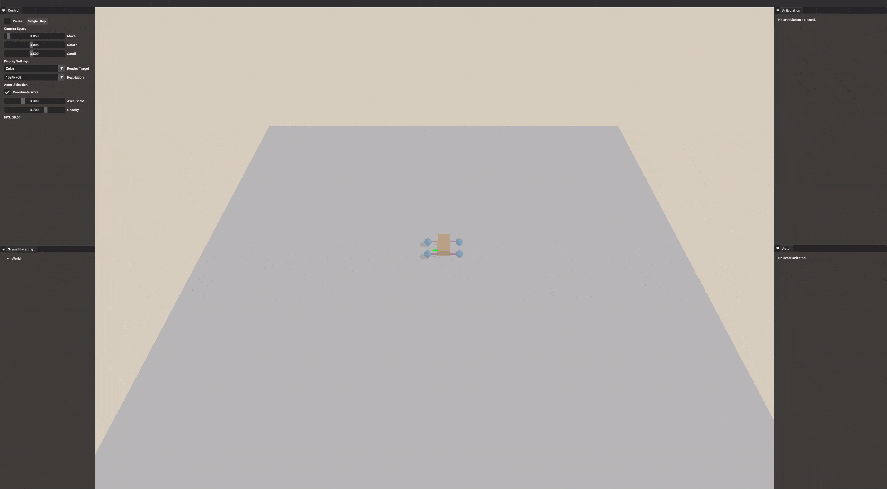

.. _create_articulations:

Create Articulations
=====================

.. highlight:: python
   :linenothreshold: 5

The **articulation** is a set of **links** (each of which behaves like a rigid body) connected together with special **joints**.
For instance, a drawer can be connected to a table by a prismatic joint (slider), and a door can be connected to a frame by a revolute joint (hinge).
A robot is also an instance of articulation.
Articulations can be controlled by applying torques on their joints.

In this tutorial, you will learn the following:

* Create ``Articulation``
* Control the articulation with builtin controllers
* Get kinematic quantities of joints

The example illustrates how to build a controllable toy car from scratch.
``transforms3d`` is required.

The full script can be downloaded here :download:`create_articulations.py <../../../../examples/basic/create_articulations.py>`

Create a root link
-------------------------------------------

In SAPIEN, the articulation is represented as a tree.
Each node is a link, and each edge indicates that the child link is connected to the parent link by a joint.
To build a toy car, let's start with the car body.

.. literalinclude:: ../../../../examples/basic/create_articulations.py
   :dedent: 0
   :lines: 19-36

``Articulation`` is created by ``ArticulationBuilder``.
Each link is built by ``LinkBuilder``, which can be created by an articulation builder.
A root link is created when ``create_link_builder()`` is called without specifying the parent link.

Create a child link connected by a revolute joint
----------------------------------------------------

Next, we create a child link (front steering shaft) connected to the root link (car body).

.. literalinclude:: ../../../../examples/basic/create_articulations.py
   :dedent: 0
   :lines: 38-60

A link is just a rigid body, and thus collision and visual shapes can be added.
Besides, we need to configure the joint.

There are multiple types of joints: prismatic, revolute, fixed.
The definitions follow `PhysX <https://gameworksdocs.nvidia.com/PhysX/4.1/documentation/physxguide/Manual/Joints.html>`_.

* **revolute**: a revolute joint (also called a hinge) keeps the origins and x-axes of the frames together, and allows free rotation around this common axis.
* **prismatic**: a prismatic joint (also called a slider) keeps the orientations identical, but allows the origin of each frame to slide freely along the common x-axis.
* **fixed**: a fixed joint locks the orientations and origins rigidly together

The location of the joint is defined by the transformtation ``parent_pose`` from the parent frame to the joint frame, and the transformtation ``child_pose`` from the child frame to the joint frame.

Other properties, like joint friction and joint damping, can also be set through ``set_joint_properties(...)``.

Control an articulation with builtin drives
----------------------------------------------------

After building the toy car, we want to control it by actuating its joints.
SAPIEN provides builtin **drives** (controllers) to control either the position or the speed of the joint.

.. literalinclude:: ../../../../examples/basic/create_articulations.py
   :dedent: 0
   :lines: 211-215

The active joints (with non-zero degree of freedom) can be obtained by calling ``get_active_joints()``.
For each active joint, we can set its drive properties: ``stiffness`` and ``damping``.
They implies the extent to which the drive attempts to achieve the target position and velocity respectively.
There do not exist a general rule to set those values and you usually should tune them case by case.
If you are familiar with control theory, they correspond to *P* and *D* terms in `PID controller <https://en.wikipedia.org/wiki/PID_controller>`_.
The initial target position and velocity of a joint are zero by default.
Since our toy car is designed as a front-wheel drive car, we set both the stiffness and damping as zero for the back rack.

We can use the keyboard to modify the target positions and velocities of active joints.
``set_drive_target(...)`` and ``set_drive_velocity_target(...)`` are called to set the target position and velocity of a joint drive.

.. literalinclude:: ../../../../examples/basic/create_articulations.py
   :dedent: 0
   :lines: 217-241