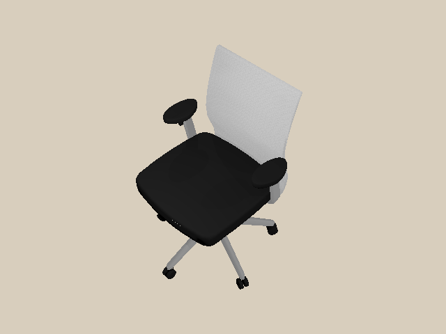
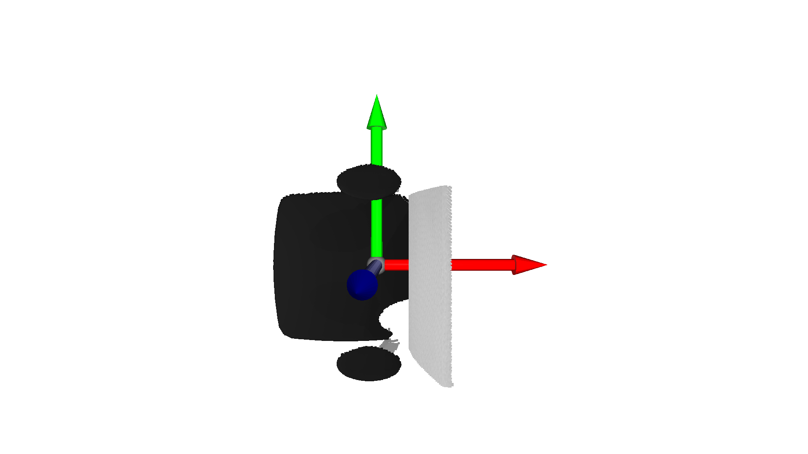
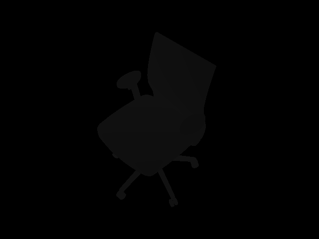
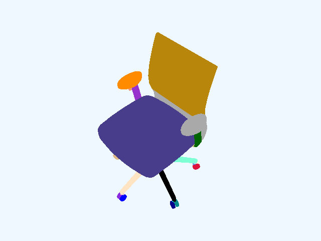
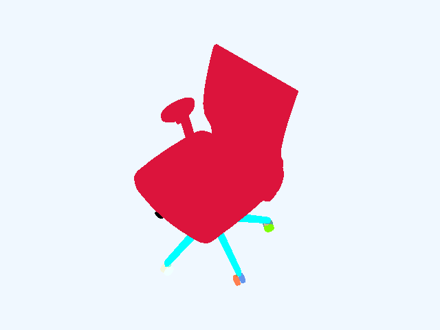

.. _camera:

Camera
==================

.. highlight:: python

In this tutorial, you will learn the following:

* Create a camera ``ICamera`` and mount it to an actor
* Off-screen rendering for RGB, depth, point cloud and segmentation

The full script can be downloaded here :download:`camera.py <../../../../examples/rendering/camera.py>`

Create and mount a camera
------------------------------------------------------------

First of all, let's set up the engine, renderer, scene, lighting, and load a URDF file.

.. literalinclude:: ../../../../examples/rendering/camera.py
   :dedent: 0
   :lines: 15-33

We create a Vulkan-based renderer by calling ``sapien.VulkanRenderer(offscreen_only=...)``.
If ``offscreen_only=True``, the on-screen display is disabled. 
It works without a window server like x-server.
You can forget about all the difficulties working with x-server and OpenGL!

Next, you can create a camera and mount it somewhere as follows:

.. literalinclude:: ../../../../examples/rendering/camera.py
    :dedent: 0
    :lines: 38-63

Camera should be mounted on an ``Actor``.
If the mounted actor is kinematic (and static), then the camera is fixed.
Otherwise, the camera moves along with the actor on which it mounts.

.. warning::
    The camera extrinsic is defined by both the poses of the mounted camera and the camera.
    Thus, we could set the pose of the camera by specifying the pose of the mounted actor.

.. note::
    Note that the axes conventions for SAPIEN follow the conventions for robotics,
    while they are different from those for many graphics softwares (like OpenGL and Blender).
    For a SAPIEN camera, the x-axis points forward, the y-axis left, and the z-axis upwards.

Render RGB image
------------------------------------------------------------

To render from a camera, you need to first update all object states to the renderer.
Then, you should call ``take_picture()`` to actually render. 

.. literalinclude:: ../../../../examples/rendering/camera.py
    :dedent: 0
    :lines: 65-67

Now, we can acquire the RGB image rendered by the camera.
To save the image, we use `pillow <https://pillow.readthedocs.io/en/stable/>`_ here, which can be installed by ``pip install pillow``.

.. literalinclude:: ../../../../examples/rendering/camera.py
    :dedent: 0
    :lines: 72-75

Generate point cloud
------------------------------------------------------------

Point cloud is a common representation of 3D scenes.
The following code showcases how to acquire the point cloud in SAPIEN.

.. literalinclude:: ../../../../examples/rendering/camera.py
    :dedent: 0
    :lines: 80-88

We acquire a "position" image with 4 channels.
The first 3 channels represent the 3D position of each pixel in the OpenGL camera space,
and the last channel is a flag indicating whether the position is beyond the camera frustrum far plane.

Note that the position is represented in the OpenGL camera space, where the negative z-axis points forward and the y-axis is upward.
Thus, if you want to acquire a point cloud in the SAPIEN camera space or world space (x forward and z up), some convertions are required.

We visualize the point cloud by `Open3D <http://www.open3d.org/>`_, which can be installed by ``pip install open3d``.

Besides, the depth map can be obtained as well.

.. literalinclude:: ../../../../examples/rendering/camera.py
    :dedent: 0
    :lines: 97-100

Visualize segmentation
------------------------------------------------------------

SAPIEN provides the interfaces to acquire object-level segmentation.

.. literalinclude:: ../../../../examples/rendering/camera.py
    :dedent: 0
    :lines: 105-116

There are two levels of segmentation.
One is mesh-level, and the other one is actor-level.
The examples are illustrated below.

   Mesh-level segmentation

   Actor-level segmentation