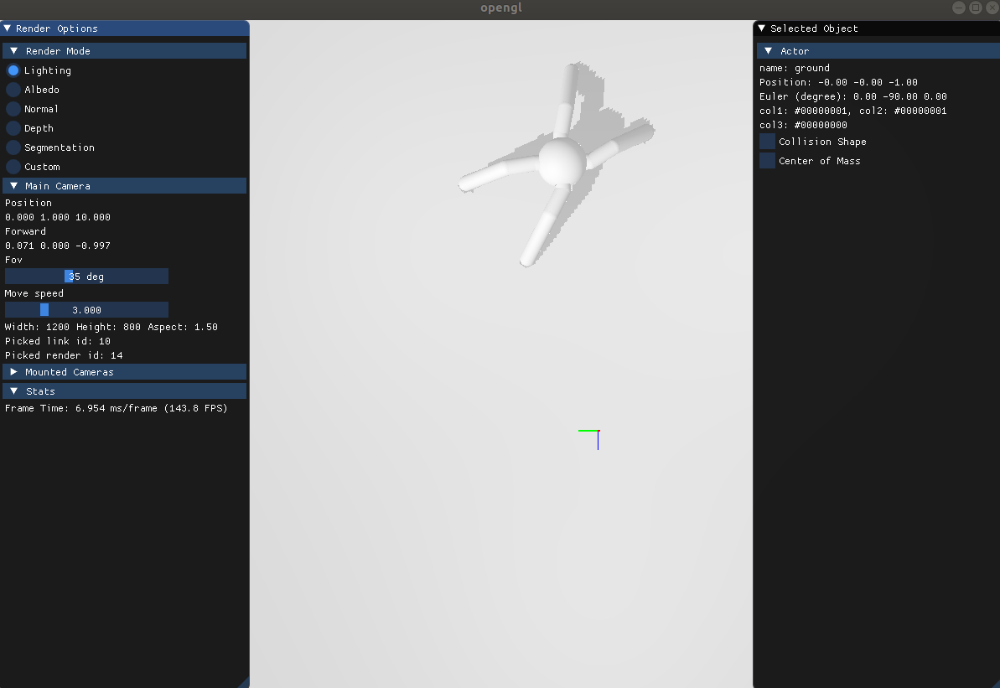

Build Gym-Style interface
==========================

.. highlight:: python
   :linenothreshold: 5

`OpenAI Gym <https://gym.openai.com/>`_ is widely used for reinforcement learning research.
It is often desirable to have "Gym-style" environment interface to perform RL tasks.

In this tutorial, you will learn the following:

* Build an robot ant with SAPIEN pure Python API
* Set and get the states of objects
* Pack current simulation and restore it later
* Customize a simple Ant environment for training RL

.. note::
   If you haven’t already done so, make sure you’ve completed the steps in :doc:`minimal` and :doc:`render` section before starting tutorial of the robotics part.

Write a SAPIEN environment base
--------------------------------------

To build an Gym-style interface for control tasks, we may first write an virtual class base like `Gym MujocoEnv <https://github.com/openai/gym/blob/master/gym/envs/mujoco/mujoco_env.py>`_. This will be a virtual class with many unimplemented member functions.

Environment base constructor
************************************

The major member variables can be divided into three groups:

1. For running simulation
2. For rendering
3. For apply control signal and get observation

Based on these principals, the constructor can be organized as follow:

.. literalinclude:: ../../../../example/basic/gym_style_interface.py
   :lineno-start: 98
   :lines: 98-120

Create the scene and renderer as usual, load robot model and actuator information in order to take action.

Get observation for agent
**************************

To perform RL tasks, we also need to get the observation after each simulation step. The following function shows how to get the internal state of agent.

.. literalinclude:: ../../../../example/basic/gym_style_interface.py
   :lineno-start: 136
   :lines: 136-154

.. note::
   Unlike MuJoCo, there is no free joint in SAPIEN. Thus, ``get_qpos()`` functions will not return the pose of root link. In order to capture this information, we need to do it explicitly.

Virtual functions to be implemented
************************************

There will be some model-specific functions to be implemented for child class.

.. literalinclude:: ../../../../example/basic/gym_style_interface.py
   :lineno-start: 164
   :lines: 164-177

Build an ant robot purely by Python
--------------------------------------

Now we are going to implement an Ant environment. To do that, an articulated ant model is needed.
Besides loading from a URDF file described here :ref:`load_urdf`, an articulated object/robot can also be directly created with Python.

The general idea is to create an ArticulationBuilder for ant and several LinkBuilder for each articulation link as follow:

You may refer to :ref:`gym-entire_code` or run an standalone example :download:`here <../../../../example/sapien_core_example/ant.py>` for details.

This function will return an ArticulationBuilder filled with an ant model. This builder can be used more than once to build many ants as you like.

Ant environment class
-----------------------
Then implemented the Ant Environment as follow:

.. literalinclude:: ../../../../example/basic/gym_style_interface.py
   :lineno-start: 180
   :lines: 180-246
   :emphasize-lines: 28, 50

The highlighted lines show how to save the internal simulation states and load it later. Note that this function is only for an single model but not entire simulation scene.

Use Ant environment
---------------------
Now we can use our ``SapienAntEnv`` as ``Gym``.

.. literalinclude:: ../../../../example/basic/gym_style_interface.py
   :lineno-start: 249
   :lines: 249-257

You will see something like that:

.. _gym-entire_code:

The entire code
------------------

.. note::
   To run the example below, you need to pip install ``transforms3d`` for transformation conversion and ``gym`` for action_spec.

Download the entire code :download:`here <../../../../example/basic/gym_style_interface.py>`.

