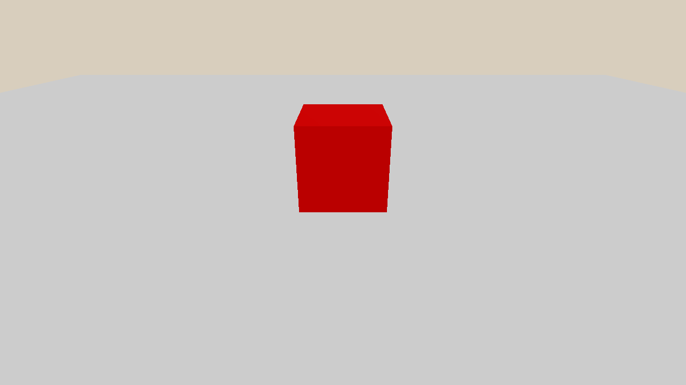

.. _hello_world:

Hello World
==================

.. highlight:: python

SAPIEN provides APIs to build physical simulation environments.

In this tutorial, you will learn the following:

* Create a simulation engine ``Engine``
* Create a simulation scene ``Scene``
* Setup a renderer to visualize
* Run a simulation loop

The full script can be downloaded here :download:`hello_world.py <../../../../examples/basic/hello_world.py>`

Simulation engine and scene
-------------------------------------

To simulate with SAPIEN, you need to first create a simulation engine, and then create a simulation scene by the engine.

.. literalinclude:: ../../../../examples/basic/hello_world.py
   :dedent: 0
   :lines: 18-23

``Engine`` is the physical simulation engine connected to the `PhysX
<https://gameworksdocs.nvidia.com/PhysX/4.1/documentation/physxguide/Manual/Index.html>`_
backend. One engine per process is allowed. Creating additional engines without deleting (overwriting the variable, letting it go out of scope) a previous one will result in the same Engine being returned.

``Scene`` is an instance of the simulation world.
Multiple scenes can be created through ``create_scene``, and they are independent.

``SapienRenderer`` is the rendering engine connected to our `Vulkan <https://www.khronos.org/vulkan/>`_-based renderer.
the renderer should first be bound with an engine, and then all the scenes created by the engine will be bound with the renderer.

Add rigid bodies
-------------------

So far, our scene is empty.

In SAPIEN, a simulated rigid body is named an ``Actor``.
Let's add two actors, a ground and a box, to the scene.
Actor creation will be elaborated in :ref:`create_actors`.

.. literalinclude:: ../../../../examples/basic/hello_world.py
   :dedent: 0
   :lines: 26-31

Viewer
-------------------------------------------

``Viewer`` creates a window (GUI) to render the simulation world.
It is only available with a connected display (e.g. monitor).
Usage of the GUI will be elaborated in :ref:`viewer`.

.. literalinclude:: ../../../../examples/basic/hello_world.py
   :dedent: 0
   :lines: 33-47

.. note::
   The GUI is not necessary when you only need physical simulation, e.g. collecting experiences for policy learning.

Simulation loop
---------------

After setting up the simulation world, the actual simulation happens in a loop.
For each iteration, the scene simulates for one step and updates the world to the renderer.
The viewer calls ``render`` to update the results on the screen.

.. literalinclude:: ../../../../examples/basic/hello_world.py
   :dedent: 0
   :lines: 49-52

Full script
----------------

.. literalinclude:: ../../../../examples/basic/hello_world.py
    :linenos:
    :lines: 12-
