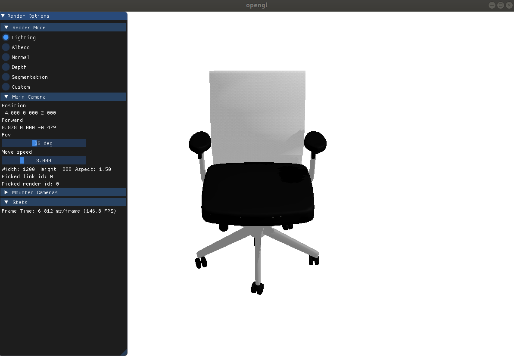

.. _minimal:

A minimal example
==================

.. highlight:: python
   :linenothreshold: 5

SAPIEN provides a serial of API to build and evaluate your simulation environment.
In this tutorial, you will learn the following:

* Create a simulation scene to run simulation step
* Setup a renderer to visualize the simulated results
* Load an articulated object from URDF file

Installation
------------
First install SAPIEN python package from PyPI.

.. code::

   pip install sapien

Simulation engine and scene
-------------------------------------

To use SAPIEN simulation, first create a simulation engine and use engine to build a simulation scene.

.. literalinclude:: ../../../../example/basic/minimal.py
   :lineno-start: 1
   :lines: 1-8

An ``engine`` in SAPIEN is the most basic interface for physical simulation,
which can create a simulation scene.
Each ``scene`` is a simulation instance where individual simulation runs on and can take ``step()``.
It is something like ``env`` in OpenAI Gym.
You can create multiple scene which can simulation step independently.
``renderer`` is the most basic interface for rendering, one render will take charge of all scenes.

On screen rendering by renderer controller
-------------------------------------------

``renderer_controller`` monitor the on-screen rendering, it us useful to visualize the simulation after
bind a ``scene`` by ``set_current_scene()``.

.. literalinclude:: ../../../../example/basic/minimal.py
   :lineno-start: 10
   :lines: 10-17

.. note::
   You need the ``show_window()`` to see the visualization by create a GL window, and use ``hide_window`` once you do not need it.

.. _load_urdf:

Load SAPIEN assets
-------------------

So far there nothing is in our simulation ``scene``. To load SAPIEN assets, we create a urdf loader to load
it from file.

.. literalinclude:: ../../../../example/basic/minimal.py
   :lineno-start: 19
   :lines: 19-20

Simulation Loop
---------------

Now we begin simulation loop take ``step()``. Press ``q`` on the keyboard at anytime to exit.

.. literalinclude:: ../../../../example/basic/minimal.py
   :lineno-start: 22
   :lines: 22-25

.. note::
   The ``update_renderer()`` will send the data to the renderer. Comment it and you visualization will stay static.

You will see the visualization like following:

Change visualization mode
-----------------------------------

The on screen rendering is based upon `imgui <https://github.com/ocornut/imgui>`_. It provides convenient
GUI for visualization and debug. Switch the rendering mode at the left panel to get more information about the current scene.
For example, segmentaion will be as follow:

.. figure:: assets/segmentation.png
    :width: 640px
    :align: center
    :figclass: align-center

The entire code
----------------

.. literalinclude:: ../../../../example/basic/minimal.py

