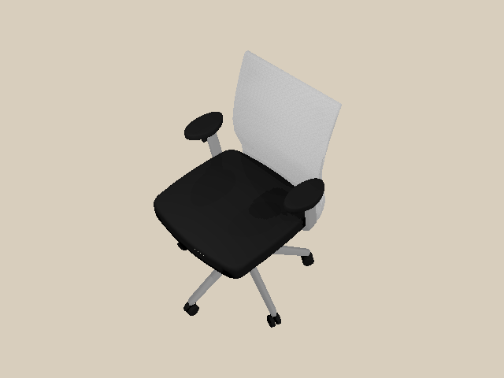
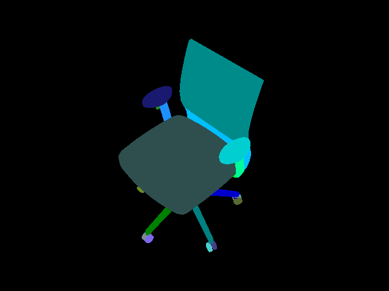
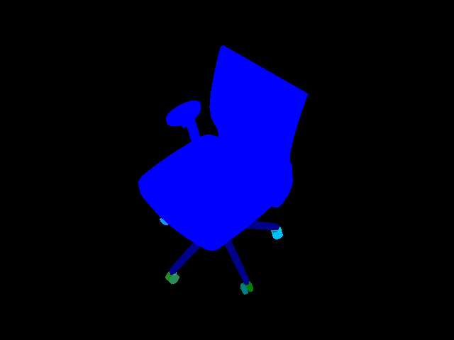
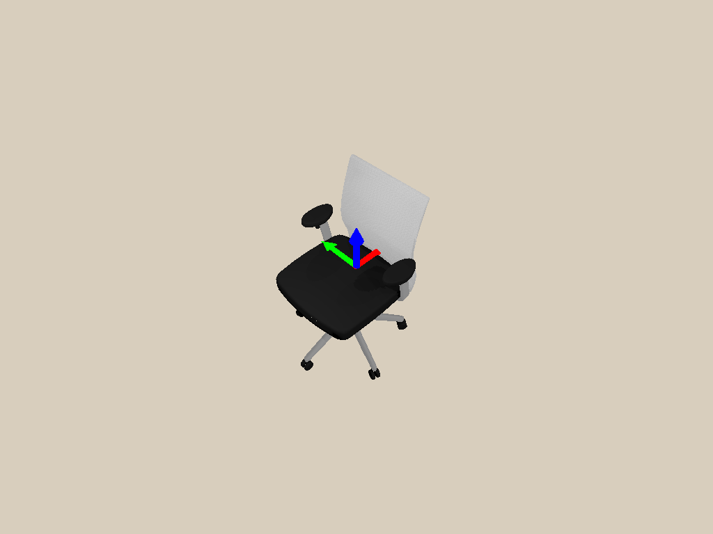

.. _camera:

Camera
==================

.. highlight:: python

In this tutorial, you will learn the following:

* Create a camera ``CameraEntity`` and mount it to an actor
* Off-screen rendering for RGB, depth, point cloud and segmentation

The full script can be downloaded here :download:`camera.py <../../../../examples/rendering/camera.py>`

Create and mount a camera
------------------------------------------------------------

First of all, let's set up the engine, renderer, scene, lighting, and load a URDF file.

.. literalinclude:: ../../../../examples/rendering/camera.py
   :dedent: 0
   :lines: 17-36

We create the Vulkan-based renderer by calling ``sapien.SapienRenderer(offscreen_only=...)``.
If ``offscreen_only=True``, the on-screen display is disabled. 
It works without a window server like x-server.
You can forget about all the difficulties working with x-server and OpenGL!

..
   Next, you can create a camera and mount it somewhere as follows:

   .. literalinclude:: ../../../../examples/rendering/camera.py
       :dedent: 0
       :lines: 41-66

Next, you can create a camera as follows:

   .. literalinclude:: ../../../../examples/rendering/camera.py
       :dedent: 0
       :lines: 41-51

This camera is now placed at coordinate `[1, 0, 0]` without rotation.

An camera can also be mounted onto an ``Actor`` to keep a pose relative to the
actor as follows:

   .. literalinclude:: ../../../../examples/rendering/camera.py
       :dedent: 0
       :lines: 55-67

The camera is mounted on the the ``camera_mount_actor`` through ``set_parent``. The
pose of the camera relative to the mount is specified through ``set_local_pose``.

.. note::
   Calling ``set_local_pose`` without a parent sets the global pose of the camera.
   Callling ``set_pose`` with a parent results in an error, as it is ambiguous.

The process of adding and mounting a camera can be achieved through the
convenience function ``add_mounted_camera`` (which used to be the only way to
add a camera).

   .. literalinclude:: ../../../../examples/rendering/camera_old.py
       :dedent: 0
       :lines: 41-53

If the mounted actor is kinematic (or static), the camera moves along
with the actor when the actor of the actor is changed through ``set_pose``. If
the actor is dynamic, the camera moves along with it during dynamic simulation.

.. note::
    Note that the axes conventions for SAPIEN follow the conventions for robotics,
    while they are different from those for many graphics softwares (like OpenGL and Blender).
    For a SAPIEN camera, the x-axis points forward, the y-axis left, and the z-axis upward.

    However, do note that the "position" texture (camera-space point cloud)
    obtained from the camera still follows the graphics convention (x-axis
    right, y-axis upward, z-axis backward). This maintains consistency of SAPIEN
    with most other graphics software. This will be further discussed below.

Render an RGB image
------------------------------------------------------------

To render from a camera, you need to first update all object states to the renderer.
Then, you should call ``take_picture()`` to start the rendering task on the GPU.

.. literalinclude:: ../../../../examples/rendering/camera.py
    :dedent: 0
    :lines: 69-71

Now, we can acquire the RGB image rendered by the camera.
To save the image, we use `pillow <https://pillow.readthedocs.io/en/stable/>`_ here, which can be installed by ``pip install pillow``.

.. literalinclude:: ../../../../examples/rendering/camera.py
    :dedent: 0
    :lines: 76-81

Generate point cloud
------------------------------------------------------------

Point cloud is a common representation of 3D scenes.
The following code showcases how to acquire the point cloud in SAPIEN.

.. literalinclude:: ../../../../examples/rendering/camera.py
    :dedent: 0
    :lines: 86-87

We acquire a "position" image with 4 channels. The first 3 channels represent
the 3D position of each pixel in the OpenGL camera space, and the last channel
stores the z-buffer value commonly used in rendering. When is value is 1, the
position of this pixel is beyond the far plane of the camera frustum.

.. literalinclude:: ../../../../examples/rendering/camera.py
    :dedent: 0
    :lines: 89-95

Note that the position is represented in the OpenGL camera space, where the negative z-axis points forward and the y-axis is upward.
Thus, to acquire a point cloud in the SAPIEN world space (x forward and z up), 
we provide ``get_model_matrix()``, which returns the transformation from the OpenGL camera space to the SAPIEN world space.

We visualize the point cloud by `Open3D <http://www.open3d.org/>`_, which can be installed by ``pip install open3d``.

.. figure:: assets/point_cloud.png
   :width: 1080px
   :align: center

Besides, the depth map can be obtained as well.

.. literalinclude:: ../../../../examples/rendering/camera.py
    :dedent: 0
    :lines: 107-110

.. figure:: assets/depth.png
   :width: 1080px
   :align: center

Visualize segmentation
------------------------------------------------------------

SAPIEN provides the interfaces to acquire object-level segmentation.

.. literalinclude:: ../../../../examples/rendering/camera.py
    :dedent: 0
    :lines: 117-129

There are two levels of segmentation.
The first one is mesh-level, and the other one is actor-level.
The examples are illustrated below.

   Mesh-level segmentation

   Actor-level segmentation

Take a screenshot from the viewer
------------------------------------------------------------

The viewer provides a `Take Screenshot` button, which saves the current viewer
image to `sapien_screenshot_x.png`, where `x` is an integer that automatically
increases starting from 0.

The ``Window`` of the viewer also provides the same interfaces as
``CameraEntity``, ``get_float_texture`` and ``get_uint32_texture``, to allow
taking screenshots programmatically. Thus, you could take a screenshot by
calling them. Notice the definition of ``rpy`` (roll, yaw, pitch) when you set
the viewer camera.

.. literalinclude:: ../../../../examples/rendering/camera.py
    :dedent: 0
    :lines: 134-155

