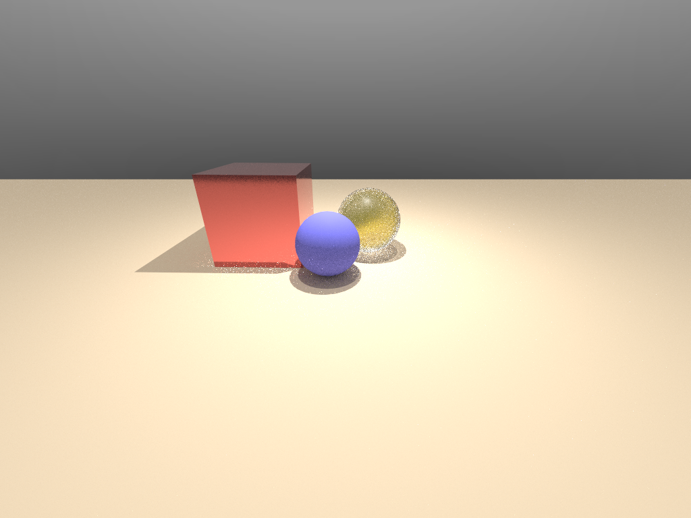

.. _customize_shaders:

Customize Shaders
====================================

SAPIEN renderer compiles GLSL shaders on the fly. One may provide new shader
files to change the behavior of SAPIEN renderer completely.

This tutorial covers the design of SAPIEN's shader packs, and demonstrates how
to customize the renderer with 2 examples:

* Add a depth-of-field effect to the rasterization pipeline (coming soon)
* Add a per-pixel sampling variance measure to the ray-tracing pipeline

.. note::

   This tutorial assumes knowledge of GPU pipelines and GLSL. If you are not
   familiar with the them, we recommend reading `Vulkan tutorial
   <https://vulkan-tutorial.com/>`_ and `OpenGL tutorial
   <https://learnopengl.com/Getting-started/OpenGL>`_ first.

.. warning::

   The current design for renderer customization is experimental. You may expect
   frequent breaking changes in future versions.

Shader pack
----------------

A shader pack in SAPIEN is a directory containing glsl files. SAPIEN parses the
file names and file contents under this directory to determine rendering
bahavior.

If `gbuffer.frag` exists, SAPIEN recognizes the directory as a rasterization
shader pack, if `camera.rgen` exists, SAPIEN recognizes the directory as a
ray-tracing shader pack.

The best way to understand SAPIEN's shaders is by reading them. The default
rasterization shader pack directory can be found by shell command

.. code-block:: shell

   python -c 'import os,sapien; print(os.path.dirname(sapien.__file__) + "/vulkan_shader/ibl")'

The default ray traacing shader pack directory can be found by shell command

.. code-block:: shell

   python -c 'import os,sapien; print(os.path.dirname(sapien.__file__) + "/vulkan_shader/rt")'

Rasterization pipeline
-----------------------------

SAPIEN adopts a multi-pass deferred rendering pipeline for rasterization. The
passes are determined by files in the shader pack.

Render passes
^^^^^^^^^^^^^^^^^^

A render pass is identified by files describing its shader stages. To enable
render pass `A`, you need to create `A.vert`, `A.geom`, and/or `A.frag` under
the shader pack directory.

SAPIEN rasterization pipeline **requires** a `gbuffer` pass. At the minimum, a
rasterization shader pack contains `gbuffer.vert` and `gbuffer.frag` files. All
other files are optional to describe more complex pipelines.

If `gbuffer1.vert` and `gbuffer1.frag` exist. The `gbuffer` pass only processes
opaque objects and `gbuffer1` pass processes transparent objects. More over if
`gbuffer{x}.vert` and `gbuffer{x}.frag` exist where `{x}` is consecutive
integers starting from 2. SAPIEN will render objects marked with render mode
`{x}` with this pass (this functionality has not been exposed to Python).

2 other special gbuffer passes are the `point` pass and `line` pass, which
processes point and line primitives.

`shadow` pass describes shadow map generation and only contains the vertex
shader stage `shadow.vert`. Multiple render passes will be created during
rendering depending on the number of lights added to the scene.

`deferred` pass describes the deferred lighting stage. `deferred.vert` is almost
always the same code that draws a full-screen triangle. `deferred.frag` should
compute lighting from rendering results of the `gbuffer` pass.

`composite` passes are additional `deferred` passes for multi-pass
post-processing. They share a `composite.vert` that is identical to
`deferred.vert`. Their fragment shaders are named `composite{x}.frag` where
`{x}` are consecutive integers starting from 0.

Geometry input
^^^^^^^^^^^^^^^^^^^

Geometries (mesh, point clouds, etc.) are specified as input parameters to
vertex shader of gbuffer passes (`gbuffer{x}.vert`, `point.vert`, `line.vert`).
SAPIEN has 6 built-in input attributes ``vec3 position``, ``vec3 normal``,
``vec2 uv``, ``vec3 tangent``, ``vec3 bitangent``, ``vec4 color``. ``position``
is the required attribute and must be placed at `location=0`. All other
attributes are optional and SAPIEN automatically identifies them and loads them
to the GPU. They can be placed in any order, but their locations must be
consecutive integers. Here is an example of a valid input layout.

.. code-block:: glsl

   layout(location = 0) in vec3 position;
   layout(location = 1) in vec3 normal;
   layout(location = 2) in vec2 uv;
   layout(location = 3) in vec3 tangent;
   layout(location = 4) in vec3 bitangent;

.. note::

   All `gbuffer{x}` passes must use the same vertex layout, even across
   different shaders.

   All `point` and `line` passes must use the same vertex layout, even across
   different shaders.

Uniform input
^^^^^^^^^^^^^^^^^^^^^^^

Property of objects, the camera, and the scene are bound as uniform buffers and
textures in descriptor sets. Each descriptor set can use any set number. SAPIEN
recognizes these sets by their names.

Camera set
""""""""""""

The camera set should have the following buffer at binding 0. The name
``CameraBuffer`` and ``cameraBuffer`` are mandatory.

.. code-block:: glsl

   layout(set = 0, binding = 0) uniform CameraBuffer {
     mat4 viewMatrix;                 // view matrix of the current frame
     mat4 projectionMatrix;           // projection matrix of this camera
     mat4 viewMatrixInverse;
     mat4 projectionMatrixInverse;
     mat4 prevViewMatrix;             // view matrix of the previous frame
     mat4 prevViewMatrixInverse;
     float width;                     // render target width
     float height;                    // render target height
   } cameraBuffer;

Object set
""""""""""""

The object set should have the following buffer at binding 0. The name
``ObjectBuffer`` and ``objectBuffer`` are mandatory.

.. code-block:: glsl

   layout(set = 1, binding = 0) uniform ObjectBuffer {
     mat4 modelMatrix;
     mat4 prevModelMatrix;     // model matrix of the previous frame
     uvec4 segmentation;       // stores SAPIEN's mesh and actor segmentation
     float transparency;       // used by the viewer to render transparency
     int shadeFlat;            // disable normal interpolation
   } objectBuffer;

Material set
""""""""""""""

The material set should always be the same.

.. code-block:: glsl

   layout(set = 2, binding = 0) uniform MaterialBuffer {
     vec4 emission;
     vec4 baseColor;
     float fresnel;
     float roughness;
     float metallic;
     float transmission;
     float ior;
     float transmissionRoughness;
     int textureMask;
     int padding1;
   } materialBuffer;

Scene set
""""""""""""

The scene set should have the following buffer at binding 0 and 1. The name
``SceneBuffer``, ``sceneBuffer``, ``LightBuffer``, ``ShadowBuffer``, and
``shadowBuffer`` are mandatory.

.. code-block:: glsl

   layout(set = 0, binding = 0) uniform SceneBuffer {
     vec4 ambientLight;
     DirectionalLight directionalLights[3];
     SpotLight spotLights[10];
     PointLight pointLights[10];
     SpotLight texturedLights[1];
   } sceneBuffer;

   struct LightBuffer {
     mat4 viewMatrix;
     mat4 viewMatrixInverse;
     mat4 projectionMatrix;
     mat4 projectionMatrixInverse;
     int width;
     int height;
   };

   layout(set = 0, binding = 1) uniform ShadowBuffer {
     LightBuffer directionalLightBuffers[3];
     LightBuffer spotLightBuffers[10];
     LightBuffer pointLightBuffers[60];  // 1 point light requires 6 buffers
     LightBuffer texturedLightBuffers[1];
   } shadowBuffer;

If shadow map is enabled, the next few bindings are used for the depth maps.

.. code-block:: glsl

   layout(set = 3, binding = 2) uniform samplerCube samplerPointLightDepths[3];
   layout(set = 3, binding = 3) uniform sampler2D samplerDirectionalLightDepths[1];
   layout(set = 3, binding = 4) uniform sampler2D samplerTexturedLightDepths[1];
   layout(set = 3, binding = 5) uniform sampler2D samplerSpotLightDepths[10];

Additionally, if textured light (active light) is enabled, a texture light
texture is required. Currently only 1 textured light texture is supported.

.. code-block:: glsl

   layout(set = 3, binding = 6) uniform sampler2D samplerTexturedLightTextures[1];

You are also required to declare the following specialization constants that
match the numbers used in ``SceneBuffer`` and ``ShadowBuffer``. The order does
not matter. These numbers also correspond to the maximum number of lights and
shadows allowed for this shader.

.. code-block:: glsl

   layout (constant_id = 0) const int NUM_DIRECTIONAL_LIGHTS = 3;
   layout (constant_id = 1) const int NUM_POINT_LIGHTS = 10;
   layout (constant_id = 2) const int NUM_DIRECTIONAL_LIGHT_SHADOWS = 1;
   layout (constant_id = 3) const int NUM_POINT_LIGHT_SHADOWS = 3;
   layout (constant_id = 4) const int NUM_TEXTURED_LIGHT_SHADOWS = 1;
   layout (constant_id = 5) const int NUM_SPOT_LIGHT_SHADOWS = 10;
   layout (constant_id = 6) const int NUM_SPOT_LIGHTS = 10;

Additionally, the scene set has 2 more recognized textures ``sampleEnvironment``
and ``sampleBRDFLUT``

.. code-block:: glsl

   layout(set = 3, binding = 7) uniform samplerCube samplerEnvironment;
   layout(set = 3, binding = 8) uniform sampler2D samplerBRDFLUT;

``sampleEnvironment`` is the texture specified by SAPIEN's ``set_environment_map``
functions. ``sampleBRDFLUT`` is a fixed texture used in `image based lighting <https://learnopengl.com/PBR/IBL/Specular-IBL>`_.

Render targets
^^^^^^^^^^^^^^^^

Render targets are textures written by the renderer. These textures are
eventually retrieved by ``camera.get_texture`` (formerly
``camera.get_float_texture``, ``camera.get_color_rgba``) and
``camera.get_dl_tensor``.

Output
""""""""""

When render targets are written as a color attachment, you need to add an `out`
as prefix to its name. For example in `gbuffer` shader, one may do

.. code-block:: glsl

   layout(location = 0) out vec4 outAlbedo;
   layout(location = 1) out vec4 outSpecular;
   layout(location = 2) out vec4 outNormal;
   layout(location = 3) out uvec4 outSegmentation;

SAPIEN recognizes these names and create float textures named `Albedo`,
`Specular`, and `Normal`, as well as uint texture `Segmentation`.

Input
""""""""""

When render targets need to be used as input to `deferred` and `composite`
passes, you need to add a `sampler` as prefix to its name. And use a separate
descriptor set to bind them. For example in `deferred.frag`, you may do

.. code-block:: glsl

   layout(set = 2, binding = 0) uniform sampler2D samplerAlbedo;
   layout(set = 2, binding = 1) uniform sampler2D samplerNormal;
   layout(set = 2, binding = 2) uniform sampler2D samplerSpecular;

   layout(location = 0) out vec4 outLighting;

This tells SAPIEN renderer to use the `Albedo`, `Normal`, and `Specular`
textures generated from a previous pass, and this pass generates the `Lighting`
texture.

Ray tracing pipeline
-----------------------------

Uniform input
^^^^^^^^^^^^^^^^^^^^^^

Similar to the rasterization pipeline, information about the camera and the
scene are provided through descriptor sets. However, object and material
information are part of the scene as all obejcts and material information must
be available at once for ray-tracing.

The camera set is identical to the rasterization pipeline. The scene set is
described as follows.

.. code-block:: glsl

   struct GeometryInstance {
     uint geometryIndex;
     uint materialIndex;
     int padding0;
     int padding1;
   };

   struct Material {
     vec4 emission;
     vec4 baseColor;
     float fresnel;
     float roughness;
     float metallic;
     float transmission;
     float ior;
     float transmissionRoughness;
     int textureMask;
     int padding1;
   };

   struct TextureIndex {
     int diffuse;
     int metallic;
     int roughness;
     int emission;
     int normal;
     int occlusion;
     int padding0;
     int padding1;
   };

   struct Object {
     uvec4 segmentation;
     float transparency;
     int shadeFlat;
     int padding0;
     int padding1;
   };

   layout(set = 1, binding = 0) uniform accelerationStructureEXT tlas;

   layout(set = 1, binding = 1) readonly buffer GeometryInstances
   {
     GeometryInstance i[];
   } geometryInstances;

   layout(set = 1, binding = 2) readonly buffer Materials
   {
     Material m;
   } materials[];

   layout(set = 1, binding = 3) readonly buffer TextureIndices
   {
     TextureIndex t[];
   } textureIndices;

   layout(set = 1, binding = 4) uniform sampler2D textures[];

   layout(set = 1, binding = 5) readonly buffer PointLights
   {
     PointLight l[];
   } pointLights;

   layout(set = 1, binding = 6) readonly buffer DirectionalLights
   {
     DirectionalLight l[];
   } directionalLights;

   layout(set = 1, binding = 7) readonly buffer SpotLights
   {
     SpotLight l[];
   } spotLights;

   layout(std430, set = 1, binding = 8) readonly buffer Vertices {
     Vertex v[];
   } vertices[];

   layout(set = 1, binding = 9) readonly buffer Indices {
     uint i[];
   } indices[];

   layout(set = 1, binding = 10) uniform samplerCube samplerEnvironment;

   layout(set = 1, binding = 11) readonly buffer Objects {
     Object o[];
   } objects;

The set number and binding order does not matter. the ``Vertices`` buffer must
be using `std430` so that it is compatible with the rasterization pipeline if
you want to use both shader pipelines in SAPIEN.

Ray generation
^^^^^^^^^^^^^^^^^^

Ray tracing's entry point is always the ray generation shader `camera.rgen`.

The render targets must be all specified in this stage. Unlike the rasterization
pipeline, render targets are specified as stroage images instead of color
attachments. For example,

.. code-block:: glsl

   layout(set = 0, binding = 0, rgba32f) uniform image2D outHdrColor;
   layout(set = 0, binding = 1, rgba32f) uniform image2D outAlbedo;
   layout(set = 0, binding = 2, rgba32f) uniform image2D outNormal;
   layout(set = 0, binding = 3, rgba32ui) uniform uimage2D outSegmentation;
   layout(set = 0, binding = 4, rgba32f) uniform image2D outRadiance;

Ray miss
^^^^^^^^^^^^^^^^^^

SAPIEN renderer expects `camera.rmiss` and `shadow.rmiss` files for camera ray
miss and shadow ray miss respectively.

Ray hit
^^^^^^^^^^^

SAPIEN renderer expects `camera.rahit` for any hit and `camera.rchit` for
closest hit. Shadow ray tracing, and next ray sampling should happen in
`camera.rchit`.

Denoising
^^^^^^^^^^^^^^^^^^

If hardware allows, SAPIEN renderer uses the OptiX denoiser to perform denoising
on `HdrColor` texture with `Albedo` and `Normal` textures.

Post processing
^^^^^^^^^^^^^^^^^^

After ray tracing and optionally denoising, a
full-screen `postprocessing.comp` compute shader is invoked to process the
render targets (e.g., doing gamma correction). This shader expects storage
images as input.

.. code-block:: glsl

   layout(set = 0, binding = 0, rgba32f) uniform readonly image2D HdrColor;
   layout(set = 0, binding = 1, rgba32f) uniform writeonly image2D Color;

Parameters
^^^^^^^^^^^^^

Parameters to the ray-tracing pipeline is specified through push constants.

.. code-block:: glsl

   layout(push_constant) uniform Constants {
     vec3 ambientLight;
     int frameCount;                   // current accumulated frame
     int spp;                          // samples per pixel
     int maxDepth;                     // max camera ray bounces

     int russianRoulette;              // whether to use Russian Roulette
     int russianRouletteMinBounces;    // starting point for Russian Roulette

     int pointLightCount;              // number of point lights
     int directionalLightCount;        // number of directional lights
     int spotLightCount;               // number of spot lights (including textured lights)

     int envmap;                       // whether to use envmap or ambient light
   };

Example: ray tracing variance
---------------------------------

Create a new shader pack
^^^^^^^^^^^^^^^^^^^^^^^^^^^^

Copy the default `rt` shader pack. For example, name it `rt-variance`.

Modify the camera and viewer shader directory to the new `rt-variance` folder.

.. code-block:: python

    sapien.render_config.camera_shader_dir = "./rt-variance"
    sapien.render_config.viewer_shader_dir = "./rt-variance"

Add a new output texture
^^^^^^^^^^^^^^^^^^^^^^^^^^^^

Edit `camera.rgen` file and declare the variance texture.

.. highlight:: glsl

.. literalinclude:: ../../../../examples/rendering/rt-variance/camera.rgen
   :dedent: 0
   :lines: 11-16

Compute variance
^^^^^^^^^^^^^^^^^^^^^^^^^^^^

In addition to accumulating the radiance, we also accumulate its square.

.. literalinclude:: ../../../../examples/rendering/rt-variance/camera.rgen
   :dedent: 0
   :lines: 38-39

.. literalinclude:: ../../../../examples/rendering/rt-variance/camera.rgen
   :dedent: 0
   :lines: 84-85

.. literalinclude:: ../../../../examples/rendering/rt-variance/camera.rgen
   :dedent: 0
   :lines: 88-89

Finally, compute incremental variance across frames

.. literalinclude:: ../../../../examples/rendering/rt-variance/camera.rgen
   :dedent: 0
   :lines: 91-106

Now the `Variance` and `Color` texture on 32 samples per pixel looks like

.. |pic1| image:: assets/variance.png
    :width: 45%

|pic1| |pic2|
