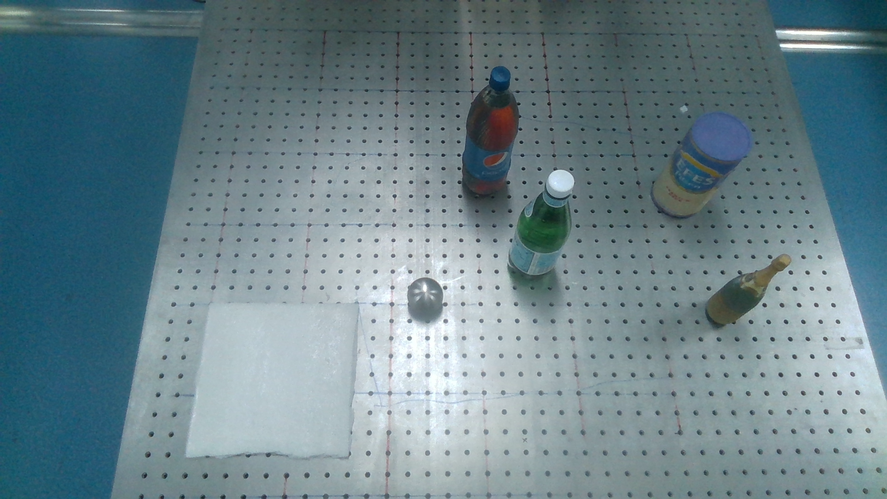
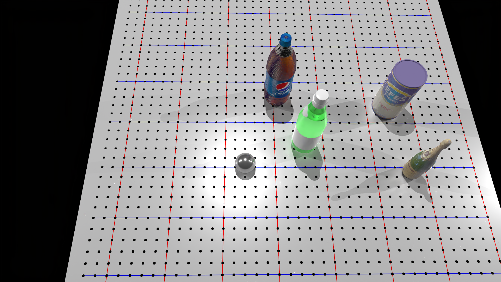
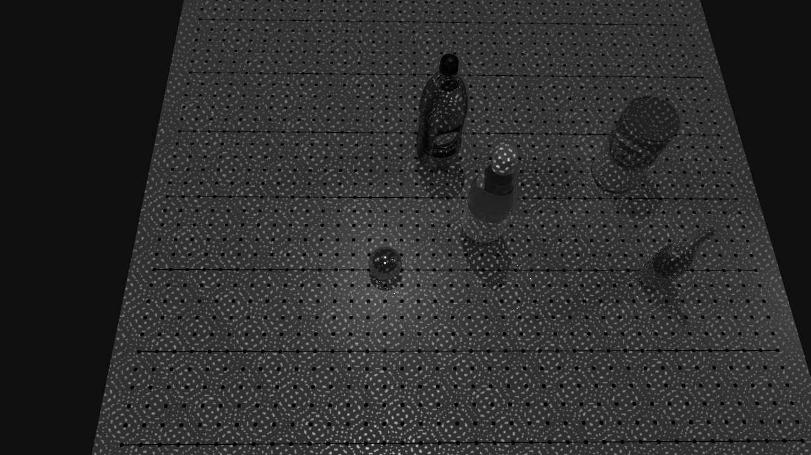
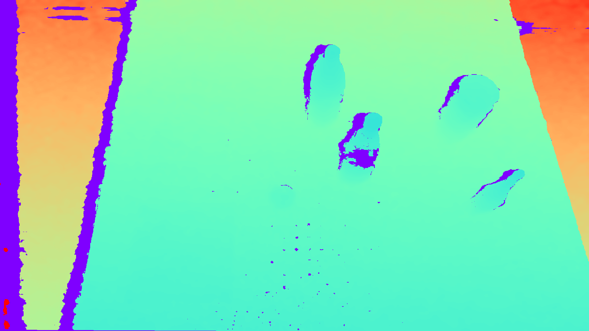
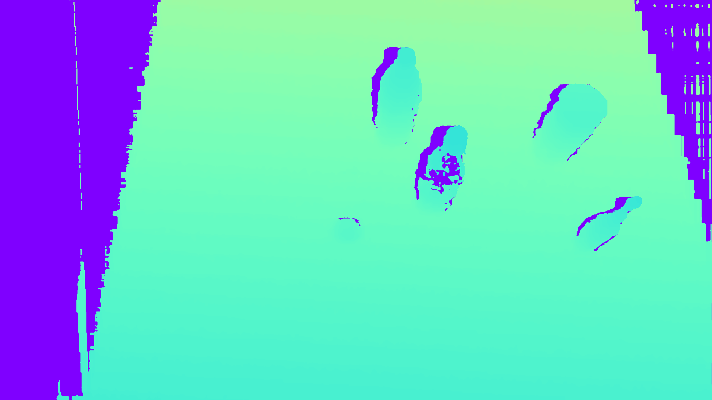
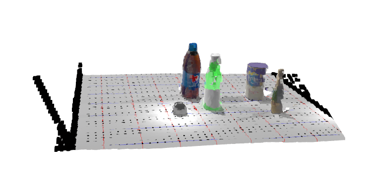

.. _depth_sensor:

SAPIEN Realistic Depth [New!]
======================

.. highlight:: python

In this tutorial, you will learn the following:

* Simulating realistic depth with ``StereoDepthSensor``

The full script can be downloaded from :download:`rt_stereodepth.py <../../../../examples/rendering/rt_stereodepth.py>`

.. note::
   You are required to have an NVIDIA GPU with 6.0 <= compute capability <= 8.6 to use ``StereoDepthSensor``. For users without available NVIDIA
   GPU, there is an alternative implementation named ``ActiveLightSensor`` that can run on CPU. Note that ``ActiveLightSensor`` will produce slightly
   different results compared to ``StereoDepthSensor`` and will be much slower. Usage of ``StereoDepthSensor`` is always recommended when an NVIDIA
   GPU is available.

Sim-to-real gap
---------------
Simulation is a powerful tool for developing and testing computer vision/robotic algorithms, but there is often a significant gap between the performance
of the algorithms in simulation and its performance in the real world. This is known as the **sim-to-real gap**. Among different types of input of real-world
oriented algorithms, depth is one of the most important type of data that has extensive use. It is found that using depth data from simulated depth sensor as
input can improve sim-to-real performance by a large margin compared to using ground truth depth [1]. Inspired by this, SAPIEN is integrated with a **real-time**
active stereo sensor simulation pipeline that will produce depth similar to real-world depth sensors. This tutorial will guide you through the process of using
``StereoDepthSensor`` to generate *SAPIEN Realistic Depth* and apply it to your system.

Realistic depth sensor simulation
---------------------------------
Let's see an example of generating SAPIEN Realistic Depth with ``StereoDepthSensor``. First of all, we need to import the class we will be using, and set
up our renderer and scene:

::

    from sapien.core import Pose
    from sapien.sensor import StereoDepthSensor, StereoDepthSensorConfig

.. literalinclude:: ../../../../examples/rendering/rt_stereodepth.py
   :dedent: 0
   :lines: 77-86

We will be using ray-tracing renderer in this section. While ``StereoDepthSensor`` also supports rasterization renderer, using ray-tracing renderer can
give us more realistic results. The scene we will be using is a simulated scene aligned to the following real scene:

You can find the detailed code of ``build_scene`` in the full script.

Now, let's add a ``StereoDepthSensor`` to the scene:

::

    sensor_config = StereoDepthSensorConfig()
    sensor = StereoDepthSensor('sensor', scene, sensor_config)

``StereoDepthSensor`` supports a large number of configurable parameters to maximize its flexibility of simulating different sensors. For more information,
Please check the API doc for class ``StereoDepthSensorConfig``.

Optionally, you can mount the sensor to an existing actor:

::

    sensor_config = StereoDepthSensorConfig()
    sensor = StereoDepthSensor('sensor', scene, sensor_config, mount=actor, pose=Pose()) # pose is relative to mount

After mounting to an actor, the sensor will move along with it. Calling ``sensor.set_local_pose`` can adjust the relative pose to the mounted actor.

``sensor`` behaves very similar to a camera. You can ``set_pose`` (or ``set_local_pose`` when mounted) and ``take_picture`` just like working with a camera.
In addtion to these basic functions, you can ``compute_depth`` and ``get_pointcloud`` on the sensor:

.. literalinclude:: ../../../../examples/rendering/rt_stereodepth.py
    :dedent: 0
    :lines: 90-95

One important difference between camera and ``sensor`` is that while camera will only take picture of an RGB image, ``sensor`` will take another pair
of infrared images, which will be used to compute depth. After calling ``take_picture``, the RGB image and infrared images will be saved within ``sensor``.
Calling ``sensor.get_rgb`` and ``sensor.get_ir`` will return the pictures in ndarray form. Let's take a look at them:

    Simulated RGB image from ``sensor``.

    One of the simulated infrared images from ``sensor``.

Calling ``compute_depth`` after ``take_picture`` will generate the depth map and save it within ``sensor``. Similarly, we can get the computed depth ndarray by
calling ``sensor.get_depth``. Let's compare our simulated depth with depth generated by real-world depth sensor:

    Depth map generated by real-world depth sensor.

    SAPIEN Realistic Depth generated by ``sensor``.

.. note::
   The final depth map will be transformed into RGB camera frame, which means that it will have the same resolution and frame as of the RGB camera. This allows easy
   integration of RGBD image or RGB point cloud.

Finally, you can easily get a point cloud by calling ``sensor.get_pointcloud``. You can choose if you want to fuse the pointcloud into a RGB point cloud (``[x, y, z, r, g, b]``)
by specifying ``with_rgb``. Let's visualize the point cloud with Open3D:

.. literalinclude:: ../../../../examples/rendering/rt_stereodepth.py
    :dedent: 0
    :lines: 115-118

    RGB point cloud restored from SAPIEN Realistic Depth.

.. note::
   The point cloud will be from RGB camera's view, with x-axis rightward, y-axis downward, and z-axis forward.

Boosting simulation speed
-------------------------
The entire depth simulation pipeline in SAPIEN has been highly-optimized on GPU. It is possible to achieve real-time (60+ FPS) performance with ``SteroDepthSensor`` under
certain resolution. Let's see a few tricks that can further boost the speed of ``StereoDepthSensor``.

If depth is the only needed data and RGB data is not needed, you can specify ``infrared_only`` when calling ``take_picture``:

::

    sensor.take_picture(infrared_only=True)

This can save the time for rendering RGB image.

As mentioned above, the final depth map generated by ``StereoDepthSensor`` will be transformed into RGB camera frame. It will be of the same resolution and frame as of the
RGB camera. This feature can be used to achieve fast downsampling/upsampling. All you need is to specify the ``rgb_resolution`` of the ``StereoDepthSensorConfig`` as the final
resolution you want to sample on, and ``StereoDepthSensor`` will do that for you on the GPU. In this way, you don't need to attach any slow CPU resampling function to it.

In general, lowering ``ir_resolution`` and ``max_disp`` of sensor config are all good ways to enhance computation speed. If you are using ray-tracing shader, lowering ``rt_samples_per_pixel``
of render config will also improve the speed by a large margin. However, note that these changes generally will have some effect (trade quality with speed) on the output depth
map. You can freely adjust the parameters until you find the settings that satisfy your need.

Seamless transfer to other GPU libraries
----------------------------------------
``StereoDepthSensor`` can return output in DLPack tensor format. DLPack tensor is a common data format that has been adopted by many popular libraries such as PyTorch
or TensorFlow. Through DLPack, the output depth map or point cloud can be seamlessly transferred into gpu tensors of those libraries without the need of additional
CPU-GPU transfer. This further allows ``StereoDepthSensor`` to maximize its speed.

In addition, ``StereoDepthSensor`` has a function ``get_depth_dl_tensor`` that can return a DLPack tensor. Through DLPack, the output depth map can be seamlessly
transferred into gpu tensors of common deep learning library such as PyTorch and TensorFlow. This can save the time for unnessecary GPU-to-CPU transfer. For example,
directly passing the generated depth map from ``StereoDepthSensor`` to PyTorch without CPU-GPU transfer is as simple as two lines:

::

    depth_dl = sensor.get_depth_dl_tensor()
    depth_tensor = torch.utils.dlpack.from_dlpack(depth_dl).clone()

This also works for transferring point cloud:

::

    pointcloud_dl = sensor.get_pointcloud_dl_tensor()
    pointcloud_tensor = torch.utils.dlpack.from_dlpack(pointcloud_dl).clone()

Reference
---------
[1] Zhang, X., Chen, R., Li, A., Xiang, F., Qin, Y., Gu, J., Ling, Z., Liu, M., Zeng, P., Han, S., Huang, Z., Mu, T., Xu, J., & Su, H. (2023). Close the Optical Sensing Domain Gap by Physics-Grounded Active Stereo Sensor Simulation. IEEE Transactions on Robotics, 1–19. https://doi.org/10.1109/TRO.2023.3235591
