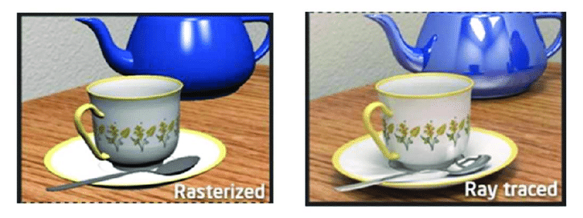
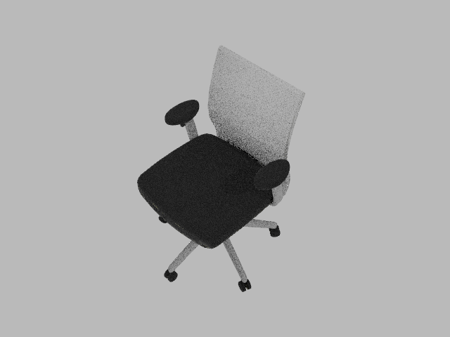
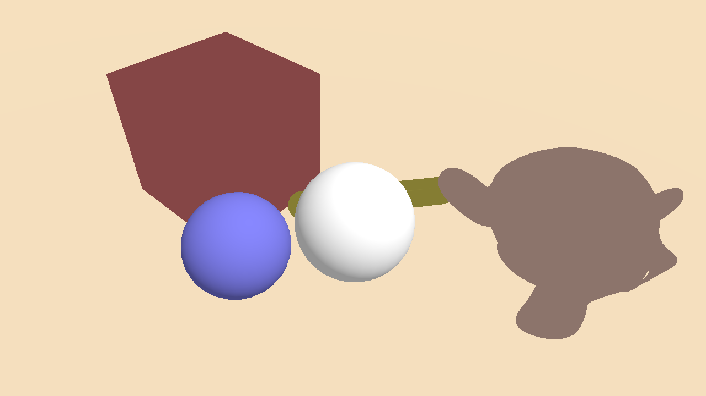

.. _raytracing_renderer:

Ray Tracing Renderer [New!]
==========================

.. highlight:: python

In this tutorial, you will learn the following:

* Use ray tracing in ``SapienRenderer``

The full script can be downloaded from :download:`rt.py <../../../../examples/rendering/rt.py>`, :download:`rt_mat.py <../../../../examples/rendering/rt_mat.py>`.

Ray tracing vs. rasterization
------------------------------------

In the previous tutorials, we have learned how to set up a basic scene with
SAPIEN and acquire rendering results under the default settings using
`SapienRenderer`. By default, `SapienRenderer` uses a high-efficiency
rasterization-based rendering pipeline, making it suitable for data-intensive
tasks such as reinforcement learning.

However, though fast, the rasterization-based renderer is not
physically-grounded, and cannot faithfully model many real-world effects,
*e.g.*, indirect lighting, realistic shadows, reflections and refractions,
making the results overly flat and lack realism. On the other end, ray tracing
renderer simulates how light rays interact with objects in a physically correct
manner, and produces images that can be indistinguishable from those captured by
a camera.

   From *A Shader-Based Ray Tracing Engine*, Park et al.

Ray tracing with SAPIEN
------------------------------------

In SAPIEN 2.2, the default renderer ``SapienRenderer`` (formerly known as
``VulkanRenderer``) supports both rasterization and ray tracing, and different
cameras can use differet rendering pipelines. Choosing a pipeline is done
through specifying a `shader pack`, which is a directory containing a collection
of `glsl` files.

To use the ray-tracing pipeline, simply add the following lines before creating a
camera or a viewer.

.. literalinclude:: ../../../../examples/rendering/rt.py
   :dedent: 0
   :lines: 17-18

That's it! You can now rerun the script with raytracing renderer. The result would look like:

You may find that the result looks more realistic with the ray tracing shader.
However the result contains noise due to under-sampling. To reduce the noise,
one way is to increase the sample-per-pixel for the renderer. To achieve this,
simply change the ``rt_samples_per_pixel`` in ``render_config``.

.. literalinclude:: ../../../../examples/rendering/rt.py
   :dedent: 0
   :lines: 19

Increasing the spp will affect the rendering speed directly. A cheaper way to reduce the noise is using a denoiser. ``SapienRenderer`` supports the OptiX denoiser on NVIDIA RTX GPUs.

.. literalinclude:: ../../../../examples/rendering/rt.py
   :dedent: 0
   :lines: 20

.. note::
   You are required to have an NVIDIA RTX GPU with driver version >= 522 installed to use the denoiser.

   While you may get the denoiser to work on drivers of lower versions, it is not officially supported.

Reflection and refraction
------------------------------------

Ray tracing allows SAPIEN to render realistic reflection and refractions.

We will create a scene in SAPIEN and render with ray tracing turned on and off.
First, let's setup the environment:

.. literalinclude:: ../../../../examples/rendering/rt_mat.py
   :dedent: 0
   :lines: 13-53

We add a flag ``ray_tracing`` to allow switching between rasterization and ray
tracing. Next, let's build the scene. First, we create a rough bluish sphere:

.. literalinclude:: ../../../../examples/rendering/rt_mat.py
   :dedent: 0
   :lines: 55-63

Next, we create a rough transparent sphere:

.. literalinclude:: ../../../../examples/rendering/rt_mat.py
   :dedent: 0
   :lines: 65-75

Generally, setting a large `transmission` value will lead to a transparent
material. Similarly, we can add a capsule and a box with complex materials:

.. literalinclude:: ../../../../examples/rendering/rt_mat.py
   :dedent: 0
   :lines: 77-95

Finally, let's load an external mesh and assign a highly metallic material to that object:

.. literalinclude:: ../../../../examples/rendering/rt_mat.py
   :dedent: 0
   :lines: 97-103

After building the scene, we can get rendering results from the camera:

.. literalinclude:: ../../../../examples/rendering/rt_mat.py
   :dedent: 0
   :lines: 108-115

    Result with default rasterizer

.. figure:: assets/mat_rt.png
    :width: 720px
    :align: center

    Result with ray tracer

