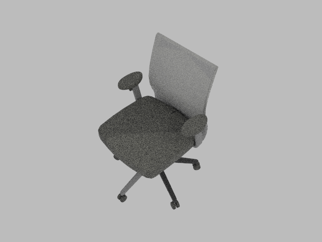
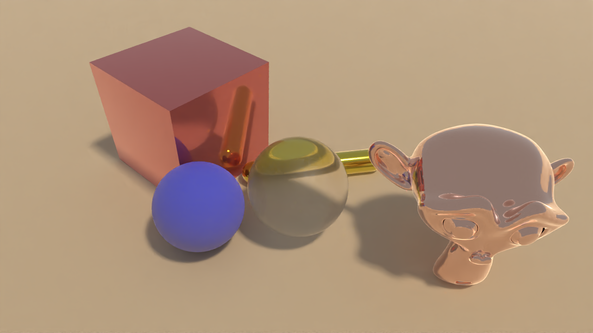
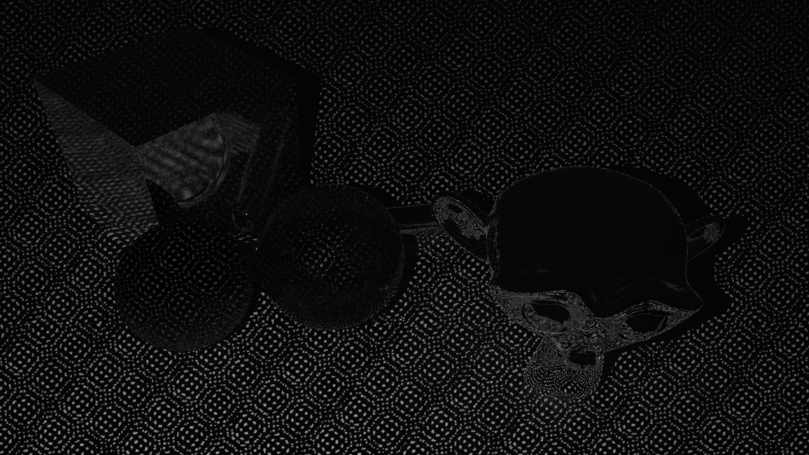
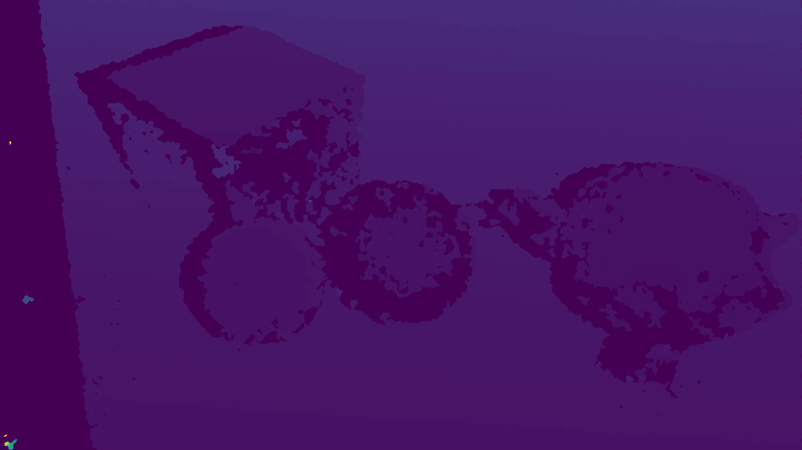
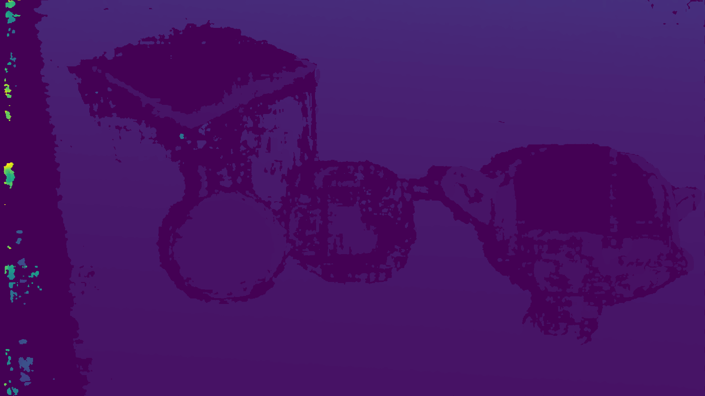

.. _raytracing_renderer:

Raytracing Renderer
==========================

.. highlight:: python

In this tutorial, you will learn the following:

* Use of raytracing-based backend *Kuafu*
* Use of GPU-accelerated depth computing module *SimSense*

The full script can be downloaded from :download:`kuafu.py <../../../../examples/rendering/kuafu.py>`, :download:`kuafu_mat.py <../../../../examples/rendering/kuafu_mat.py>`, :download:`kuafu_sensor.py <../../../../examples/rendering/kuafu_sensor.py>`, and :download:`kuafu_sensor_cuda.py <../../../../examples/rendering/kuafu_sensor_cuda.py>`

Raytracing vs. rasterization
------------------------------------

In the previous tutorials, we have learned how to set up a basic scene with SAPIEN and acquire rendering results with `VulkanRenderer`. The `VulkanRenderer` is a high-efficiency rasterization-based renderer, making it suitable for data-intensive tasks such as reinforcement learning.

However, though fast, the rasterization-based renderer is not physically-grounded, cannot render many real-world effects *e.g.* indirect lighting, realistic shadows, reflections and refractions, making the results overly *flat* and lack realism. On the other end, raytracing renderer simulates how rays interact with objects in a physically correct manner, and produces images that can be indistinguishable from those captured by a camera.

.. figure:: assets/rst_vs_rt.png
   :width: 540px
   :align: center

   From *A Shader-Based Ray Tracing Engine*, Park et al.

Raytracing with SAPIEN
------------------------------------

SAPIEN 2.0 ships with a raytracing renderer backend, named *Kuafu* (`KuafuRenderer`). Switching to Kuafu is easy, in the previous camera example, we set up the renderer with:

::

  renderer = sapien.VulkanRenderer()

To use Kuafu instead of the rasterization renderer, simply replace the line with:

::

  renderer = sapien.KuafuRenderer()

That's it! You can now rerun the script with raytracing renderer. The result would look like:

.. note::
    1. The Kuafu backend currently (2.0a) only supports `Color` downloading. Trying to download `Position` and other data from the camera will fail.
    2. The Kuafu backend does not feature full support for viewers. It is recommended to debug and build scene with `VulkanRenderer` and produce the final results with `KuafuRenderer`.

You may find that the result looks more realistic with the raytracing renderer. However the result contains noise due to under-sampling. To reduce the noise, one way is increasing the sample-per-pixel (spp) for the renderer. To achieve this, we can pass a `KuafuConfig` object when creating the renderer:

::

  render_config = sapien.KuafuConfig()
  renderer_config.spp = 256
  renderer = sapien.KuafuRenderer(render_config)

Increasing the spp will affect the rendering speed directly. A cheaper way to reduce the noise is using a denoiser. Kuafu features an OptiX denoiser by NVIDIA. To enable the denoiser, we can set the `use_denoiser` flag in the config:

::

  render_config = sapien.KuafuConfig()
  renderer_config.spp = 64
  renderer_config.use_denoiser = True
  renderer = sapien.KuafuRenderer(render_config)

.. note::
    You are required to have an NVIDIA GPU with driver version > 470 installed to use the denoiser.

Advanced Material Support in Kuafu
------------------------------------

To demonstrate the diverse material support in Kuafu. We will create a scene in SAPIEN and render with both `VulkanRenderer` and `KuafuRenderer`. First, let's setup the environment:

.. literalinclude:: ../../../../examples/rendering/kuafu_mat.py
   :dedent: 0
   :lines: 11-54

We add a flag `use_kuafu` to allow easy switching between `VulkanRenderer` and `KuafuRenderer`. Next, let's build the scene. First, we create a rough bluish sphere:

.. literalinclude:: ../../../../examples/rendering/kuafu_mat.py
   :dedent: 0
   :lines: 56-64

Next, we create a transparent sphere:

.. literalinclude:: ../../../../examples/rendering/kuafu_mat.py
   :dedent: 0
   :lines: 66-76

Generally, setting a large `transmission` value will lead to a transparent material. Similarly, we can add a capsule and a box with advanced materials:

.. literalinclude:: ../../../../examples/rendering/kuafu_mat.py
   :dedent: 0
   :lines: 78-96

Finally, let's load an external mesh and assign a highly metallic material to that object:

.. literalinclude:: ../../../../examples/rendering/kuafu_mat.py
   :dedent: 0
   :lines: 98-107

After building the scene, we can get rendering results from the camera:

.. literalinclude:: ../../../../examples/rendering/kuafu_mat.py
   :dedent: 0
   :lines: 109-116

.. figure:: assets/mat_v.png
    :width: 720px
    :align: center

    Result with `VulkanRenderer`

    Result with `KuafuRenderer`

Sensor Simulation in Kuafu
------------------------------------
.. TODO: split this into an individual section.
.. TODO: Add out paper reference

Backed by realistic rendering. SAPIEN is able to simulate the full sensor pipeline and simulate realistic sensor depth. Starting from our previously built environment, let's add a sensor to the scene:

::

  from sapien.sensor import ActiveLightSensor
  sensor = ActiveLightSensor('sensor', renderer, scene, sensor_type='d415')

The `ActiveLightSensor` class has built-in sensor types such as `d415`. We can also manually set all the sensor parameters by passing them to the class. Please check the API doc for details. The `sensor` behaves just like a mounted camera. You can `set_pose`, and `take_picture` on the sensor:

.. literalinclude:: ../../../../examples/rendering/kuafu_sensor.py
   :dedent: 0
   :lines: 98-103

After called `take_picture`. We can download RGB image, IR image, depth and point cloud from the sensor:

.. literalinclude:: ../../../../examples/rendering/kuafu_sensor.py
   :dedent: 0
   :lines: 105-119

    Simulated infra-red image from `ActiveLightSensor`.

    Simulated depth image from `ActiveLightSensor`.

GPU-accelerated Sensor Simulation with SimSense
------------------------------------
.. note::
    You are required to have an NVIDIA GPU to use SimSense.

`ActiveLightSensor.get_depth()` is a function run on CPU and is rather slow (can take more than 1s for every function call). To address this, SAPIEN is incorporated with *SimSense*, a GPU-accelerated depth computing module powered with CUDA. SimSense can directly take the infra-red images rendered by Kuafu and compute depth map in a physically-grounded fashion. SimSense is able to accelerate the original <1 fps process to over 100 fps.

To use SimSense, all you have to do is changing the `ActiveLightSensor` class introduced in the previous section into `ActiveLightSensorCUDA`, and that's it! More specifically, what you need is:

::

  from sapien.sensor import ActiveLightSensorCUDA
  sensor = ActiveLightSensorCUDA('sensor', renderer, scene, sensor_type='d415')

After that, you can use every functions of `sensor` we've introduced in the same way as before, and SimSense will be automatically triggered when gets to its part.

With the goal of closing sim2real gap, SimSense is built to provide results that are close to modern real-world depth sensors. For the same example in the previous section, depth generated by SimSense is:

    Simulated depth image from `ActiveLightSensorCUDA`.

SimSense also provides a series of configurable parameters to adapt to different real-world sensors. For more information about the configurable parameters, please check the API document.
