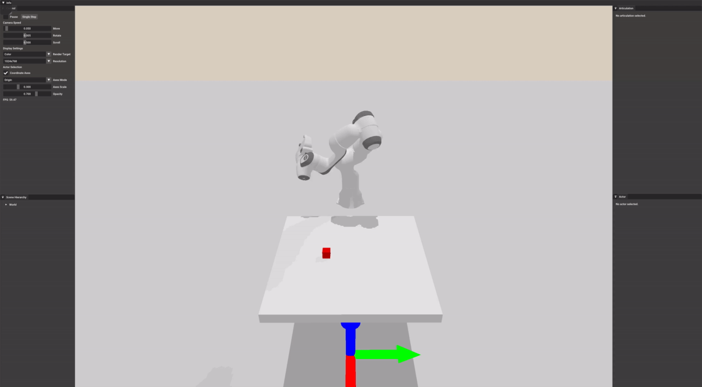

.. _manipulation_index:

Basic Manipulation
=================================

.. highlight:: python

.. note::
   Please first complete :ref:`basic_index` and :ref:`gym` before continuing this tutorial.

In this tutorial, you will learn the following:

* Implement a basic manipulation environment (block lifting)

    The panda robot arm is taking random actions.

The full code of the environment can be downloaded here :download:`lift.py <../../../../examples/rl/lift.py>`

Setup 
--------------------------------------

Based on ``SapienEnv`` implemented in the previous example (:ref:`gym`), we can create ``LiftEnv``.
The simulation world consists of the ground, a table top, a cube to lift and a panda robot arm.

.. literalinclude:: ../../../../examples/rl/lift.py
   :dedent: 0
   :lines: 12-66

We use internal velocity drives to control all joints (the first 7 joints) of the arm, except the gripper fingers.
The fingers will be directly controlled by torques.

Task Definition
--------------------------------------

Next, let's define the task of block lifting.
**The goal is to lift the cube by at least 2cm above the table top**.

.. literalinclude:: ../../../../examples/rl/lift.py
   :dedent: 0
   :lines: 71-118

The action is defined as the concatenation of target joint velocities and torques on gripper fingers.
The observation is the concatenation of joint positions, joint velocities, the pose of cube and end-effector (the 8-th link), as well as the relative displacement between the cube and end-effector.
The total reward is defined as the sum of reaching reward and lifting reward.

.. note::
   The definitions of action, observation, reward are usually heuristically designed.