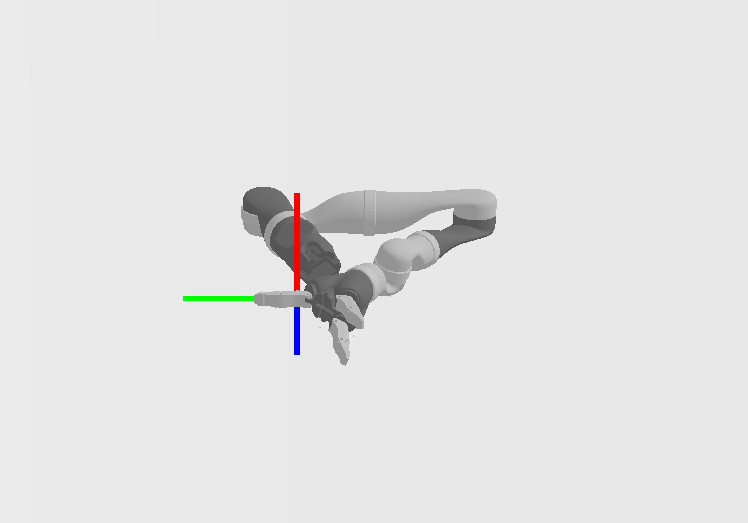

.. _get_start:

Getting Started
================

.. note::
   If you haven't already done so, make sure you've completed the steps in :ref:`basic_index` before starting tutorial of the robotics part. The assets (robot) used in this this tutorial can be found `here <https://github.com/haosulab/SAPIEN-Release/tree/master/example/assets>`_

.. highlight:: python
   :linenothreshold: 5

Set up engine, renderer and scene
--------------------------------------

First setup the simulation engine, create a
simulation scene and visualize it using renderer controller like before

.. literalinclude:: ../../../../example/robotics/get_start.py
   :lineno-start: 1
   :lines: 1-18

Load robot and set joint position
--------------------------------------

Then we create a URDF loader to load the Kinova Jaco2 arm from URDF file
and set the robot to the initial position. Note that this is a
``fix_root_link`` flag for URDF loader. If it is set to true, then the robot root
will be fixed to world coordinates, otherwise the root link will be free with all 6
degree of freedom.

.. literalinclude:: ../../../../example/robotics/get_start.py
   :dedent: 4
   :lineno-start: 20
   :lines: 20-28

Like before, run simulation step and on-screen rendering.

.. literalinclude:: ../../../../example/robotics/get_start.py
   :lineno-start: 34
   :lines: 34-44

Change flag of URDF Loader
--------------------------------------

Now we run all the code with
``robot_basic_control_demo(False, False, False)``

It is expected that you will observe the following "falling-down" robot arm.
This is caused by the ``fix_root_link`` flag, which is set to ``False`` before load the robot.

Change ``fix_robot_root`` to ``True`` and rerun the code, we still find that the robot arm can not
get to the initial position as we set. Actually, at the first simulation step, the robot
is set to our desired joint angle. However, due to gravitational force and other possible
passive force like Coriolis and Centrifugal force, the Jaco2 arm will immediately drop down.

.. note::
   When a robot is already loaded, change flags of URDF loader will have no effect on it.

Gravity compensation
--------------------------------------

For a real robot, the gravity compensation is done by a internal controller hardware.
So it is usually desirable to skip this troublesome calculation of how to compensate gravity.

In SAPIEN, we use ``compute_passive_force`` to do that. It calculates the joint force/torque
in order to compensate specified passive force. Here we only consider gravity, coriolis and centrifugal
force.

.. literalinclude:: ../../../../example/robotics/get_start.py
   :lineno-start: 40
   :dedent: 12
   :lines: 40-41

Now we run all the code with
``robot_basic_control_demo(True, True, False)``

We can see the robot can stay at the target pose for a short period as following.
However, it will then deviate from this pose gradually due to numerical error.

.. figure:: assets/robot_right_position.png
    :width: 640px
    :align: center
    :figclass: align-center

Add damping to joints
--------------------------------------

To make the robot stay at this pose, we need to add some damping to the robot joint.
It will penalize the joint velocity to stabilize the robot. Add the following code
before the while loop.

.. literalinclude:: ../../../../example/robotics/get_start.py
   :dedent: 4
   :lineno-start: 30
   :lines: 30-32

Now we run all the code with
``robot_basic_control_demo(True, True, True)``

The entire code
----------------

After that, our robot can keep it pose at the given joint angle. The entire code is as follow:

.. literalinclude:: ../../../../example/robotics/get_start.py

