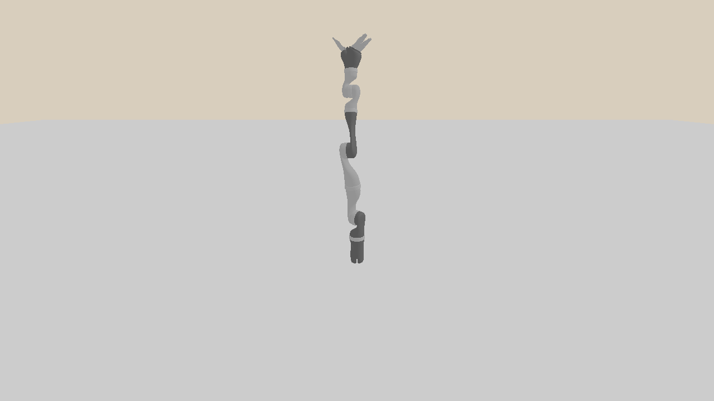

.. _pid:

Drive Robot with PID Controller
=================================

.. highlight:: python

.. note::
   Please first complete :ref:`basic_robot` before continuing.

A fundamental problem  in robotics is how to apply forces on the joints of a robot to drive them to target positions.
Such low-level control is the basis for applications, e.g., following a trajectory.

In this tutorial, you will learn the following:

* Drive the robot with the PhysX internal PD controller
* Write your own PID controller

.. figure:: assets/pid_internal.gif
    :width: 640px
    :align: center
    :figclass: align-center
    
    Drive the robot with the internal PD controller

The full script can be downloaded here :download:`pid.py <../../../../examples/robotics/pid.py>`

Setup
----------------------------------

As before, we first set up the simulation world.
Note that we decrease the timestep, which is helpful for the simple PID controller implemented in this example.

.. literalinclude:: ../../../../examples/robotics/pid.py
   :dedent: 0
   :lines: 37-69

Drive the robot with the PhysX internal PD controller
------------------------------------------------------

.. literalinclude:: ../../../../examples/robotics/pid.py
   :dedent: 0
   :lines: 71,75-80

SAPIEN provides builtin PhysX **drives** (controllers) to control either the position or speed of a joint.
For each active joint (with non-zero degree of freedom), we can call ``set_drive_property(...)`` to set its drive properties: ``stiffness`` and ``damping``.
The drive is a **proportional derivative drive**, which applies a force as follows: 

.. centered:: *force = stiffness * (targetPosition - position) + damping * (targetVelocity - velocity)*

The ``stiffness`` and ``damping`` can be regarded as the *P* and *D* term in a typical `PID controller <https://en.wikipedia.org/wiki/PID_controller>`_.
They implies the extent to which the drive attempts to achieve the target position and velocity respectively.

.. note::
   The PhysX backend in fact integrates the drive into the PhysX solver.
   The force applied will be computed implicitly every simulation step.

The initial target position and velocity of a joint are zero by default.
You can call ``joint.set_drive_target(...)`` to set the target position of a joint, or ``robot.set_drive_target(...)`` to set the target positions of all the joints of the robot.
Similarly, you can also call ``set_drive_velocity_target(...)`` to set the target velocity.

.. note::
   If you do not balance the passive force, e.g. gravity, the robot can never reach the desired pose (but maybe a close pose) given in ``set_drive_target`` due to steady-state-error.

Write your own PID controller
-----------------------------

You can write your own PID controller, if you need an integrator term *I* to compensate some steady-state-error which can not be compensated by ``compensate_passive_force``.

.. literalinclude:: ../../../../examples/robotics/pid.py
   :dedent: 0
   :lines: 6-25

.. literalinclude:: ../../../../examples/robotics/pid.py
   :dedent: 0
   :lines: 71,82-91

We provide a very simple implementation here, the parameters of which are not carefully tuned.
You can try to add extra tricks for integration or error propagation, to improve the stability of your own controller.

.. literalinclude:: ../../../../examples/robotics/pid.py
   :dedent: 0
   :lines: 93-110

   
   Drive the robot with the simple PID controller

.. note::
   In most cases, it is recommended to use the internal drive rather than your own PID.
   The PhysX internal drive is much more efficient and stable when the parameters are not carefully tuned.

.. warning::
   The parameters (``stiffness`` and ``damping``) for the internal drive in this example can not be directly used for downstream tasks like manipulation. 